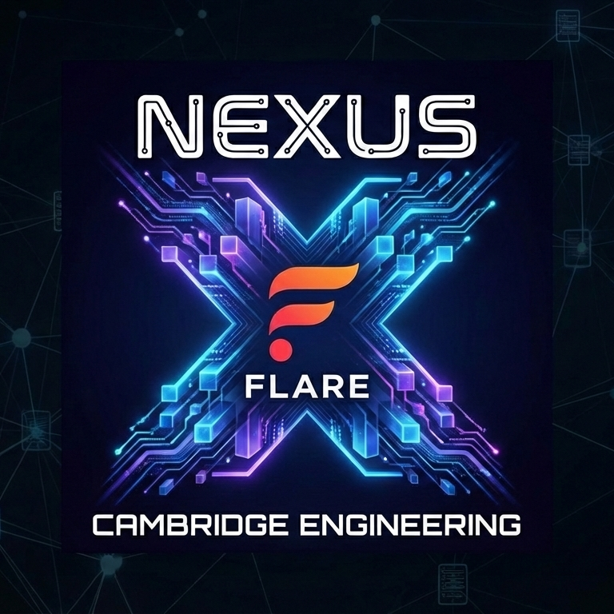
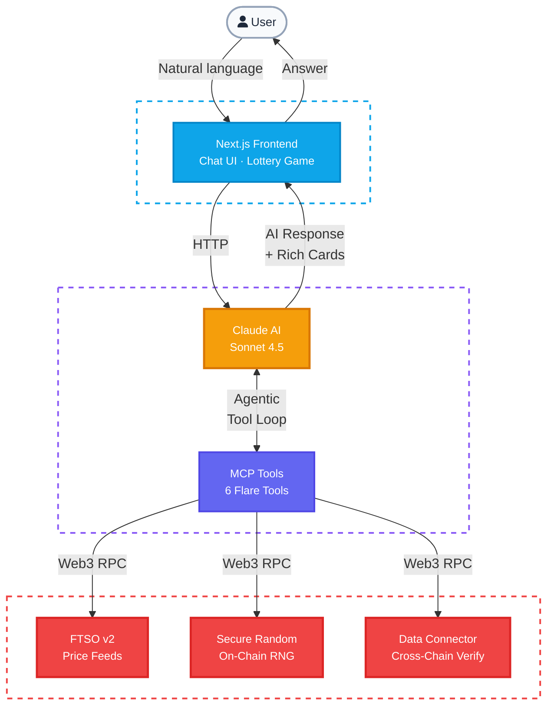

<p align="center">
  
</p>

# Flare DeFi Agent

**An AI-powered DeFi assistant that uses the Model Context Protocol (MCP) to give Claude autonomous access to Flare's on-chain data protocols.**

Built at **ETH Oxford 2026** for the Flare track.

---

## What It Does

Flare DeFi Agent is a conversational AI agent that can **read live blockchain data from the Flare network** and reason about it in real time. Instead of hard-coding API calls, we wrap Flare's three core data protocols as **MCP tools** that Claude can discover and invoke autonomously based on what the user asks.

**Ask it anything about Flare:**
- *"What's the current price of FLR?"* — reads FTSO v2 price feeds on-chain
- *"Generate a secure random number"* — calls Flare's on-chain random oracle
- *"Verify this transaction on Flare"* — triggers cross-chain verification via the Flare Data Connector

The AI decides which tools to call, executes them, interprets the results, and responds in natural language — all in one turn.

### Flare Lottery

A bonus interactive demo: a **5-digit lottery game** where each number is generated from Flare's on-chain secure random oracle. Three players roll and lock in numbers, then "Flare Central" draws the winning number — all powered by real on-chain randomness. If your number matches, you win!

---

## Why MCP?

The [Model Context Protocol](https://modelcontextprotocol.io/) is an open standard that lets AI models discover and use external tools through a unified interface. For Flare, this means:

1. **Flare's data protocols become AI-native** — any MCP-compatible agent can query FTSO prices, generate random numbers, or verify transactions without custom integration code
2. **The AI decides what to call** — Claude sees the tool descriptions, understands what data is available, and autonomously picks the right oracle for each user query
3. **Composability** — the same MCP tools work with any MCP client (Claude Desktop, custom agents, other LLMs), making Flare's protocols accessible across the AI ecosystem

### Architecture



---

## Flare Protocols Used

### 1. FTSO v2 — Decentralised Price Oracle
Real-time price feeds for FLR/USD, BTC/USD, and ETH/USD read directly from the FtsoV2 smart contract on Coston2.

### 2. Secure Random Number Generator
Cryptographically secure 256-bit random numbers from Flare's `RandomNumberV2` contract, produced via the protocol's commit-reveal entropy mechanism.

### 3. Flare Data Connector (FDC)
Cross-chain transaction verification using Flare's attestation protocol. Submits transaction hashes and retrieves proofs from the FDC verifier API.

---

## Tech Stack

| Layer | Technology |
|-------|-----------|
| **AI** | Claude Sonnet 4.5 via Anthropic API |
| **Protocol** | Model Context Protocol (MCP) |
| **Backend** | Python, FastAPI, Web3.py |
| **Frontend** | Next.js 15, React 19, TypeScript, Tailwind CSS |
| **Blockchain** | Flare Coston2 Testnet (Chain ID 114) |

---

## Running the Demo

### Prerequisites

- **Python 3.10+**
- **Node.js 18+** and **npm**
- An **Anthropic API key** (get one at [console.anthropic.com](https://console.anthropic.com))

### 1. Clone the repo

```bash
git clone https://github.com/YOUR_USERNAME/flare-defi-copilot.git
cd flare-defi-copilot
```

### 2. Backend setup

```bash
cd backend

# Create a virtual environment (recommended)
python -m venv venv
source venv/bin/activate        # Linux/macOS
# venv\Scripts\activate         # Windows

# Install dependencies
pip install -r requirements.txt

# Configure environment
cp .env.example .env
# Edit .env and add your Anthropic API key:
#   ANTHROPIC_API_KEY=sk-ant-your-key-here

# Start the backend server
uvicorn main:app --reload --host 0.0.0.0 --port 8000
```

You should see:
```
Initializing Flare oracles...
All oracles ready.
INFO:     Uvicorn running on http://0.0.0.0:8000
```

### 3. Frontend setup

Open a **new terminal**:

```bash
cd frontend

# Install dependencies
npm install

# Configure environment
cp .env.local.example .env.local
# Edit .env.local:
#   USE_MOCK=false
#   BACKEND_URL=http://localhost:8000

# Start the frontend dev server
npm run dev
```

### 4. Use it

Open **http://localhost:3000** in your browser.

**Chat page (`/`):**
- Type *"What is the current price of BTC?"* — Claude will call the FTSO v2 oracle and display a rich price card
- Type *"Generate a random number"* — Claude will call the secure random oracle
- Type *"Verify transaction 0x..."* — Claude will trigger FDC verification
- Use the sidebar quick actions for pre-built queries

**Lottery page (`/lottery`):**
1. Click **Roll** on each player to get a 5-digit number from the Flare random oracle
2. Roll as many times as you like, then click **Lock In**
3. Once all 3 players are locked, click **DRAW** on Flare Central
4. If any player's number matches the draw — they win!
5. Click **Reset** to play again

---

## Project Structure

```
flare-defi-copilot/
├── backend/
│   ├── main.py                     # FastAPI server + Claude agentic loop
│   ├── requirements.txt
│   ├── .env.example
│   └── data_Flare/                 # Flare oracle modules
│       ├── __init__.py
│       ├── flare_oracle.py         # FTSO v2 Price Oracle
│       ├── flare_random_oracle.py  # Secure Random Number Generator
│       └── flare_fdc_oracle.py     # Flare Data Connector
├── frontend/
│   ├── package.json
│   ├── next.config.ts
│   ├── tailwind.config.ts
│   ├── tsconfig.json
│   ├── .env.local.example
│   └── src/
│       ├── app/
│       │   ├── layout.tsx          # Root layout with navigation
│       │   ├── page.tsx            # Chat page
│       │   ├── lottery/page.tsx    # Lottery game
│       │   └── api/
│       │       ├── chat/route.ts   # Chat API proxy
│       │       └── lottery/route.ts# Lottery API proxy
│       ├── components/
│       │   ├── ChatPage.tsx        # Main chat interface
│       │   ├── ChatMessages.tsx    # Message feed
│       │   ├── ChatInput.tsx       # Input textarea
│       │   ├── MessageBubble.tsx   # Message rendering
│       │   ├── ToolCallCard.tsx    # Rich tool result cards
│       │   ├── Sidebar.tsx         # Sidebar with quick actions
│       │   └── TypingIndicator.tsx # Loading animation
│       ├── hooks/
│       │   └── useChat.ts         # Chat state management
│       └── lib/
│           ├── types.ts           # TypeScript interfaces
│           └── mockData.ts        # Demo mode mock responses
├── flare_mcp_server.py            # Standalone MCP server (stdio transport)
├── .gitignore
└── README.md
```

---

## How the Agentic Loop Works

1. User sends a message via the chat UI
2. Backend forwards it to Claude with 6 Flare tool definitions
3. Claude reasons about the message and decides which tools to call
4. Backend executes the tool calls against the live Flare oracles (Web3.py RPC to Coston2)
5. Tool results are fed back to Claude for further reasoning
6. Steps 3-5 repeat until Claude has all the data it needs
7. Claude generates a final natural language response
8. Frontend renders the response with rich tool result cards (price cards, random number cards, verification cards)

---

## MCP Server (Standalone)

The `flare_mcp_server.py` file is a standalone MCP server that exposes Flare tools via the stdio transport. It can be used with any MCP client:

```bash
python flare_mcp_server.py
```

This allows Flare's data protocols to be accessed from Claude Desktop, custom AI agents, or any other MCP-compatible application.

---

## Team

Built with coffee and determination at ETH Oxford 2026.

## License

MIT
