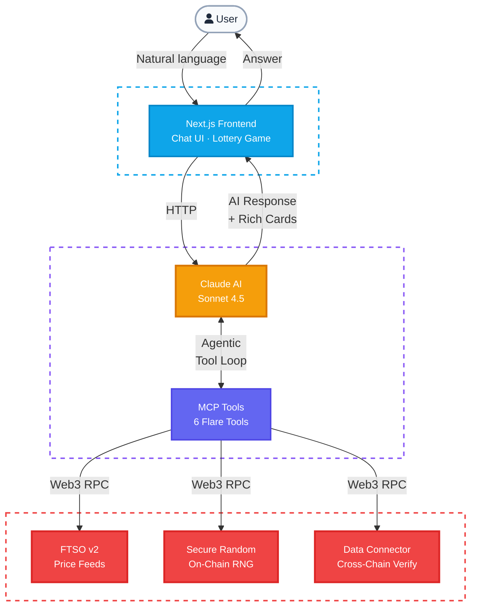

# Flare DeFi Copilot — Architecture

```mermaid
graph TB
    classDef userClass fill:#f8fafc,stroke:#94a3b8,stroke-width:2px,color:#1e293b,font-size:14px
    classDef frontClass fill:#0ea5e9,stroke:#0284c7,stroke-width:2px,color:#fff,font-size:13px
    classDef backClass fill:#8b5cf6,stroke:#7c3aed,stroke-width:2px,color:#fff,font-size:13px
    classDef aiClass fill:#f59e0b,stroke:#d97706,stroke-width:2.5px,color:#fff,font-size:13px
    classDef mcpClass fill:#6366f1,stroke:#4f46e5,stroke-width:2px,color:#fff,font-size:13px
    classDef chainClass fill:#ef4444,stroke:#dc2626,stroke-width:2.5px,color:#fff,font-size:13px

    USER(["fa:fa-user  User"]):::userClass

    subgraph FE [" "]
        direction LR
        FRONTEND["Next.js Frontend<br/>Chat UI  &middot;  Lottery Game"]:::frontClass
    end

    subgraph BE [" "]
        direction LR
        CLAUDE["Claude AI<br/>Sonnet 4.5"]:::aiClass
        MCP["MCP Tools<br/>6 Flare Tools"]:::mcpClass
    end

    subgraph CHAIN [" "]
        direction LR
        FTSO["FTSO v2<br/>Price Feeds"]:::chainClass
        RNG["Secure Random<br/>On-Chain RNG"]:::chainClass
        FDC["Data Connector<br/>Cross-Chain Verify"]:::chainClass
    end

    USER -- "Natural language" --> FRONTEND
    FRONTEND -- "HTTP" --> CLAUDE
    CLAUDE <-- "Agentic<br/>Tool Loop" --> MCP
    MCP -- "Web3 RPC" --> FTSO
    MCP -- "Web3 RPC" --> RNG
    MCP -- "Web3 RPC" --> FDC
    CLAUDE -- "AI Response<br/>+ Rich Cards" --> FRONTEND
    FRONTEND -- "Answer" --> USER

    style FE fill:none,stroke:#0ea5e9,stroke-width:2px,stroke-dasharray:6,color:#0ea5e9
    style BE fill:none,stroke:#8b5cf6,stroke-width:2px,stroke-dasharray:6,color:#8b5cf6
    style CHAIN fill:none,stroke:#ef4444,stroke-width:2px,stroke-dasharray:6,color:#ef4444
```
