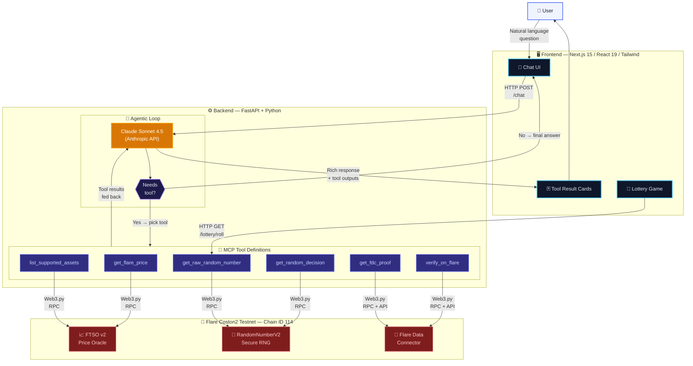
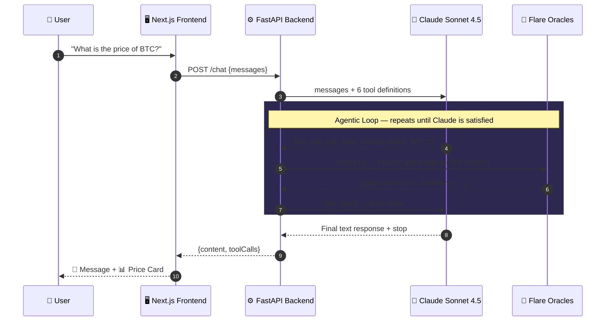
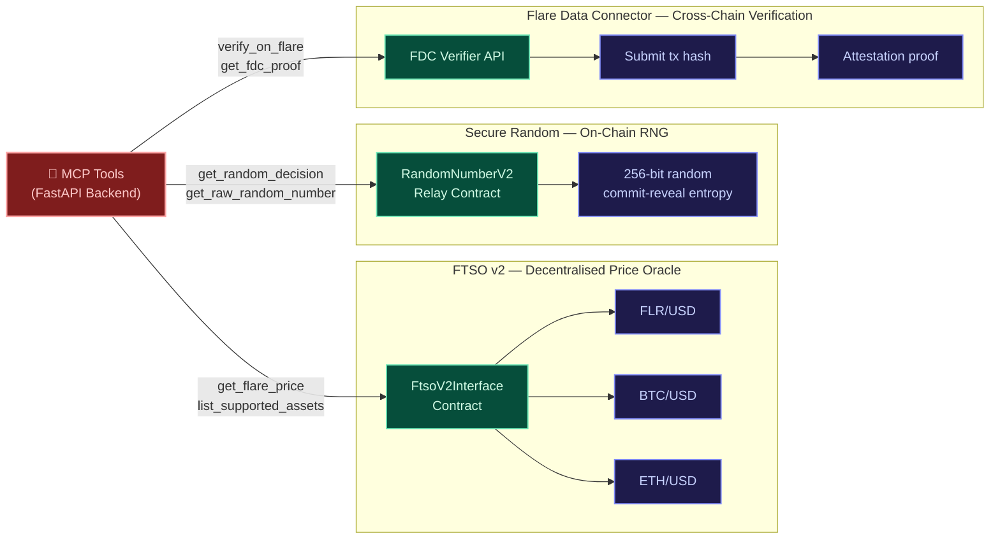

# Flare DeFi Copilot — Architecture

## System Architecture

```mermaid
graph TB
    %% ── Styling ──
    classDef user fill:#f0f4ff,stroke:#4f6df5,stroke-width:2px,color:#1a1a2e
    classDef frontend fill:#0f172a,stroke:#38bdf8,stroke-width:2px,color:#e2e8f0
    classDef backend fill:#1e1b4b,stroke:#a78bfa,stroke-width:2px,color:#e2e8f0
    classDef claude fill:#d97706,stroke:#f59e0b,stroke-width:2px,color:#fff
    classDef tools fill:#312e81,stroke:#818cf8,stroke-width:1.5px,color:#c7d2fe
    classDef flare fill:#dc2626,stroke:#f87171,stroke-width:2px,color:#fff
    classDef protocol fill:#7f1d1d,stroke:#fca5a5,stroke-width:1.5px,color:#fecaca

    %% ── User ──
    USER["👤 User"]:::user

    %% ── Frontend ──
    subgraph FRONT["🖥️ Frontend — Next.js 15 / React 19 / Tailwind"]
        direction LR
        CHAT["💬 Chat UI"]:::frontend
        CARDS["🃏 Tool Result Cards"]:::frontend
        LOTTERY["🎰 Lottery Game"]:::frontend
    end

    %% ── Backend ──
    subgraph BACK["⚙️ Backend — FastAPI + Python"]
        direction TB

        subgraph AGENT["🤖 Agentic Loop"]
            direction LR
            CLAUDE["Claude Sonnet 4.5\n(Anthropic API)"]:::claude
            DECIDE{{"Needs\ntool?"}}:::backend
        end

        subgraph MCP["🔧 MCP Tool Definitions"]
            direction TB
            T1["get_flare_price"]:::tools
            T2["get_random_decision"]:::tools
            T3["get_raw_random_number"]:::tools
            T4["verify_on_flare"]:::tools
            T5["get_fdc_proof"]:::tools
            T6["list_supported_assets"]:::tools
        end
    end

    %% ── Flare Blockchain ──
    subgraph FLARE["🔴 Flare Coston2 Testnet — Chain ID 114"]
        direction LR
        FTSO["📈 FTSO v2\nPrice Oracle"]:::protocol
        RNG["🎲 RandomNumberV2\nSecure RNG"]:::protocol
        FDC["🔗 Flare Data\nConnector"]:::protocol
    end

    %% ── Connections ──
    USER -- "Natural language\nquestion" --> CHAT
    CHAT -- "HTTP POST\n/chat" --> CLAUDE
    LOTTERY -- "HTTP GET\n/lottery/roll" --> T3

    CLAUDE --> DECIDE
    DECIDE -- "Yes → pick tool" --> MCP
    DECIDE -- "No → final answer" --> CHAT

    MCP -- "Tool results\nfed back" --> CLAUDE

    T1 & T6 -- "Web3.py\nRPC" --> FTSO
    T2 & T3 -- "Web3.py\nRPC" --> RNG
    T4 & T5 -- "Web3.py\nRPC + API" --> FDC

    CLAUDE -- "Rich response\n+ tool outputs" --> CARDS
    CARDS --> USER
```

## Agentic Tool Loop (Detail)

```mermaid
sequenceDiagram
    autonumber
    participant U as 👤 User
    participant F as 🖥️ Next.js Frontend
    participant B as ⚙️ FastAPI Backend
    participant C as 🤖 Claude Sonnet 4.5
    participant O as 🔴 Flare Oracles

    U->>F: "What is the price of BTC?"
    F->>B: POST /chat {messages}
    B->>C: messages + 6 tool definitions

    rect rgb(45, 40, 80)
        Note over B,O: Agentic Loop — repeats until Claude is satisfied
        C-->>B: tool_use: get_flare_price({symbol: "BTC"})
        B->>O: Web3.py → FtsoV2.getFeedById("BTC/USD")
        O-->>B: {price: 97342.15, timestamp: ...}
        B->>C: tool_result → price data
    end

    C-->>B: Final text response + stop
    B-->>F: {content, toolCalls}
    F-->>U: 💬 Message + 📊 Price Card
```

## Flare Protocol Integration

```mermaid
graph LR
    classDef oracle fill:#7f1d1d,stroke:#fca5a5,stroke-width:2px,color:#fecaca
    classDef data fill:#1e1b4b,stroke:#818cf8,stroke-width:1.5px,color:#c7d2fe
    classDef contract fill:#064e3b,stroke:#6ee7b7,stroke-width:1.5px,color:#d1fae5

    subgraph FTSO["FTSO v2 — Decentralised Price Oracle"]
        direction TB
        F1["FtsoV2Interface\nContract"]:::contract
        F2["FLR/USD"]:::data
        F3["BTC/USD"]:::data
        F4["ETH/USD"]:::data
        F1 --> F2 & F3 & F4
    end

    subgraph RNG["Secure Random — On-Chain RNG"]
        direction TB
        R1["RandomNumberV2\nRelay Contract"]:::contract
        R2["256-bit random\ncommit-reveal entropy"]:::data
        R1 --> R2
    end

    subgraph FDC["Flare Data Connector — Cross-Chain Verification"]
        direction TB
        D1["FDC Verifier API"]:::contract
        D2["Submit tx hash"]:::data
        D3["Attestation proof"]:::data
        D1 --> D2 --> D3
    end

    MCP["🔧 MCP Tools\n(FastAPI Backend)"]:::oracle

    MCP -- "get_flare_price\nlist_supported_assets" --> F1
    MCP -- "get_random_decision\nget_raw_random_number" --> R1
    MCP -- "verify_on_flare\nget_fdc_proof" --> D1
```
